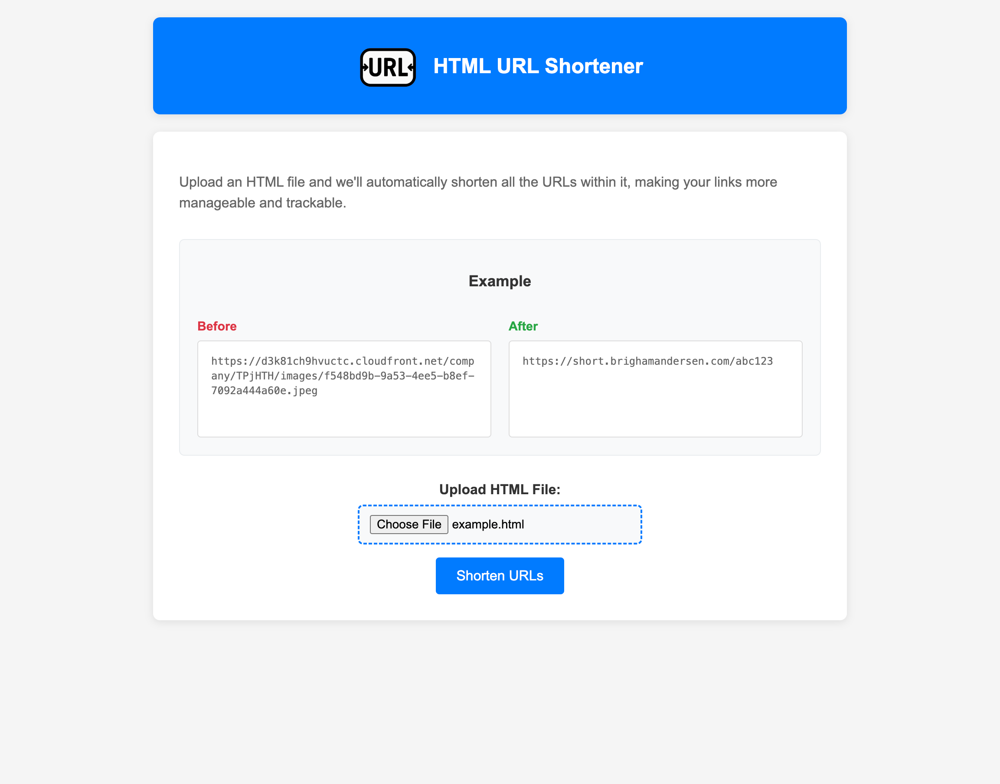
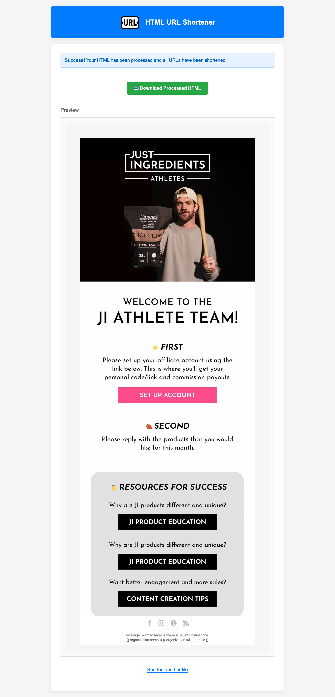

# HTML URL Shortener

Shorten all URLs within an HTML document.





To test this out on your own, go to [https://short.brighamandersen.com](https://short.brighamandersen.com) and then use [`example.html`](./example.html) as input.

## Deploying to Production

```bash
cd path/to/repo
./deploy/deploy.sh
```

## Decisions

* **Backend: Node.js with Express**
  * Chose over Python (Django/Flask) as it's more suitable for web-centric tasks without heavy data processing needs

* **Framework: Express over Remix**
  * Opted for lightweight Express to focus on backend complexity
  * Remix would be overkill for simple URL shortening without complex data loading needs

* **TypeScript: No**
  * Normally I'd like to add this but given the time constraint in building we left it out for now

* **ORM: None**
  * Skipped for now due to simple lookup requirements and better performance with Raw SQL
  * Would consider Prisma or Drizzle if needs grow

* **Database: PostgreSQL**
  * Chosen over SQLite for better scalability
  * Provides hosted persistence for higher traffic scenarios

* **Frontend: EJS Templates over React**
  * More suitable for simple 2-page app
  * Faster development with direct HTML rendering
  * Would switch to React if frontend complexity grows

* **Domain: short.brighamandersen.com**
  * Using existing domain to minimize costs
  * Chose 'short' subdomain to keep URLs compact
  * Would consider dedicated short domain for production use if we went to monetize

## Future Roadmap

If I were to build this out further, here's the roadmap:

- On the results page, it'd be good to show a list of all the links that were found in the HTML document and then show the shortened URLs next to them, so the user can visually see and test out that it's working properly. I'd try to build that out, or if I'm targeting a more technical audience, I might display it as a file diff showing the HTML file's contents before and after.
- Track number of clicks on shortened URLs